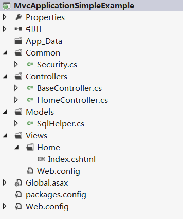
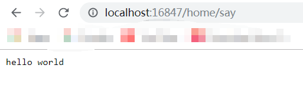

# Introduction
This repository records a simple web application frames. it's is can be used quickly to deal with database and parameter. 

# Environment

OS Platform: Windows7

Visual Studio: Microsoft Visual Studio Ultimate 2012

.NET Framework: 4.0

Language: Chinese

# Directory Structure

below is a simplification edition directory structure. 
~~~~
E:.
|   MvcApplicationSimpleExample.sln
|   Web.config
|
+---Common
|       Security.cs
|
+---Controllers
|       BaseController.cs
|       HomeController.cs
|
+---Models
|       SqlHelper.cs
|
\---Views
    |
    \---Home
            Index.cshtml
~~~~

# How to Use SqlHelper Class

the `SqlHelper` class in *SqlHelper.cs* provide an easy way to deal with the database, you only need to configure your encrypted connection string in *web.config*. `SqlHelper` provides a lot of static methods for easy access without instantiating it.

## query
```C#
class Name {
    public string firstname { set; get; }//corresponding in database table field name
    public string lastname { set; get; }//corresponding in database table field name
}
List<Name> res = SqlHelper.DoQuery<Name>("select * from TableName where firstname = @fn", new SqlParameter[]{
    new SqlParameter("@fn",firstname)
});
```
The class `Name` has two fields, each field corresponding in data table field.

## non query
```C#
SqlHelper.ExecuteNonQuery("insert into TableName([firstname],[lastname]) values(@fn,@ln)", new SqlParameter[]{ 
	new SqlParameter("@fn",firstname),
	new SqlParameter("@ln",lastname)
});
```
`SqlHelper.ExecuteNonQuery` can execute all statements except query. like *insert*,*delete*,*update*.

# How to retrieve parameters

All the controller should be inherited from `BaseController`, can call  `getPara(name,default)` to get value. all its value type is string, if you need another type, then you should convert explicitly into it which you are expected.
```C#
string firstname = GetPara("firstname");
int age = Int32.Parse(GetPara("age"));
```

# How to take the encrypted password string

In the *web.config* file, you need to configure your database connection string in `connectionStrings` node. add a `<add name="" connectionString="">` subnode, the `name` property should always be `DbConnectionStr` value. 

below is sqlserver connection template:
```XML
<connectionStrings>
  <!--
  configure server, database name, sa, password
  -->
  <add name="DbConnectionStr" connectionString="server=.;database=databasename;uid=username;pwd=encrpytedassword"/>
</connectionStrings>
```
the password should be an encrypted string. you can use bellow snippet to encrypt and decrypt.
```C#
using System;
using System.Collections.Generic;
using System.Linq;
using System.Security.Cryptography;
using System.Text;
using System.Threading.Tasks;

class Program
{
    static void Main(string[] args)
    {
        String password = "123abc";
        //encrypt
        String encryptedStr = Security.Encrypt(password);
        //decrypt
        String decrypedStr = Security.Decrypt(encryptedStr);
    }
}
public class Security
{

    /// <summary>
    /// Encrypt
    /// </summary>
    /// <param name="str"></param>
    /// <returns></returns>
    public static string Encrypt(string str)
    {
        string ret = "";
        try
        {
            string k = "50-41-53-53-34-5F-50-41-53-53-50-41-32-5F-45-4E-43-5F-4B-45-59-00-00-00-00-00-00-00-00-00-00-00";
            AES aes = new AES();
            aes.SetParams(k);
            ret = aes.Encrypt(str);
        }
        catch { }
        return ret;
    }


    /// <summary>
    /// decrypt
    /// </summary>
    /// <param name="str"></param>
    /// <returns></returns>
    public static string Decrypt(string str)
    {
        string ret = "";
        try
        {
            string k = "50-41-53-53-34-5F-50-41-53-53-50-41-32-5F-45-4E-43-5F-4B-45-59-00-00-00-00-00-00-00-00-00-00-00";
            AES aes = new AES();
            aes.SetParams(k);
            ret = aes.Decrypt(str);
        }
        catch { }
        return ret;
    }

}
public interface ISymmetricEncryption
{
    byte[] Encrypt(byte[] byteArr);
    string Encrypt(string toEncryptStr);
    byte[] Decrypt(byte[] byteArr);
    string Decrypt(string toDecryptStr);
}
public class SymmetricEncryptor : ISymmetricEncryption
{
    const CipherMode defaultMode = CipherMode.ECB;
    const PaddingMode defaultPadding = PaddingMode.PKCS7;

    protected System.Security.Cryptography.SymmetricAlgorithm provider = null;
    public System.Security.Cryptography.SymmetricAlgorithm Provider { get { return provider; } }
    protected event Action paraChanged = delegate { };
    protected SymmetricEncryptor()
    {
        initProvider();
        initOther();
    }
    protected virtual void initProvider()
    {

    }
    private void initOther()
    {
        provider.Mode = defaultMode;
        provider.Padding = defaultPadding;
        provider.GenerateIV();
        provider.GenerateKey();
    }
    private byte[] hexStrToByteArr(string str)
    {
        return (from s in str.Split('-') select Convert.ToByte(s, 16)).ToArray();
    }
    private void setKey(string key)
    {
        try
        {
            provider.Key = hexStrToByteArr(key);
            paraChanged();
        }
        catch { throw new Exception("It is not a legal hex string.  An exception occurs at when decoding 'key' value."); }
    }
    private void setIv(string iv)
    {
        try
        {
            provider.IV = hexStrToByteArr(iv);
        }
        catch { throw new Exception("It is not a legal hex string.  An exception occurs at when decoding 'key' value."); }
    }
    /// <summary>
    /// set parameter
    /// </summary>
    /// <param name="mode"></param>
    /// <param name="paddingMode"></param>
    /// <param name="key"></param>
    /// <param name="iv"></param>
    public void SetParams(CipherMode mode, PaddingMode paddingMode, string key, string iv)
    {
        provider.Mode = mode;
        provider.Padding = paddingMode;
        setKey(key);
        if (!string.IsNullOrEmpty(iv))
        {
            setIv(iv);
        }
        paraChanged();
    }
    public void SetParams(string key, string iv)
    {
        setKey(key);
        if (!string.IsNullOrEmpty(iv))
        {
            setIv(iv);
        }
        paraChanged();
    }
    public void SetParams(string key)
    {
        setKey(key);
        paraChanged();
    }
    public void GetKeyAndIv(out string Key, out string IV)
    {
        Key = BitConverter.ToString(provider.Key);
        IV = BitConverter.ToString(provider.IV);
    }
    public virtual byte[] Encrypt(byte[] byteArr)
    {
        ICryptoTransform cTransform = provider.CreateEncryptor();
        byte[] resultArray = cTransform.TransformFinalBlock(byteArr, 0, byteArr.Length);
        return resultArray;
    }
    public virtual string Encrypt(string toEncryptStr)
    {
        byte[] toEncryptArray = System.Text.Encoding.UTF8.GetBytes(toEncryptStr);
        byte[] resultArray = Encrypt(toEncryptArray);
        return Convert.ToBase64String(resultArray, 0, resultArray.Length);
    }

    public virtual byte[] Decrypt(byte[] byteArr)
    {
        ICryptoTransform cTransform = provider.CreateDecryptor();
        byte[] resultArray = cTransform.TransformFinalBlock(byteArr, 0, byteArr.Length);
        return resultArray;
    }

    public virtual string Decrypt(string toDecryptStr)
    {
        byte[] byteArr = Convert.FromBase64String(toDecryptStr);
        byte[] resultArray = Decrypt(byteArr);
        return System.Text.Encoding.UTF8.GetString(resultArray);
    }


    public string getLegalSizeMsg()
    {
        StringBuilder sb = new StringBuilder();
        sb.AppendLine("MaxSize\tMinSize\tSkipSize");
        foreach (var item in provider.LegalKeySizes)
        {
            sb.AppendLine(string.Format("{0}\t{1}\t{2}", item.MaxSize, item.MinSize, item.SkipSize));
        }
        return sb.ToString();
    }
}
public class AES : SymmetricEncryptor
{
    protected override void initProvider()
    {
        base.initProvider();
        provider = System.Security.Cryptography.Aes.Create();
    }
    public AES()
        : base()
    {
        provider.Padding = System.Security.Cryptography.PaddingMode.Zeros;
    }

    public override string Decrypt(string toDecryptStr)
    {
        byte[] byteArr = Convert.FromBase64String(toDecryptStr);
        byte[] resultArray = Decrypt(byteArr);
        string str = System.Text.Encoding.GetEncoding("GB2312").GetString(resultArray);
        str = str.TrimEnd('\0');
        return str;
    }
    public override string Encrypt(string toEncryptStr)
    {
        byte[] toEncryptArray = System.Text.Encoding.GetEncoding("GB2312").GetBytes(toEncryptStr);
        byte[] resultArray = Encrypt(toEncryptArray);
        return Convert.ToBase64String(resultArray, 0, resultArray.Length);
    }
}
```

# Screenshot





